# 我让"哑巴模型"Jev 自己打小丑牌：一局一分钱，还比传统大模型能打

> 备选标题：
> ① 《Jev 爆火 36 小时后，我把它塞进了小丑牌——130 局实测后，我明白了 System One 的正确用法》
> ② 《别再拿大模型硬扛高频决策了：Jev × 小丑牌 10 轮实测复盘》


## 一、不会说话的模型，和它藏在名字里的野心

刷到 Jev 是九月中的一个晚上。圈子里转来转去都是同一条新闻：TypeSafe AI——创始人 Diogo Almeida，前 OpenAI 研究员——发了个新模型，是个哑巴。不写文章，不写代码，不聊天，连一句完整的话都说不出来。就这么个东西，发布不到 36 小时，14 万开发者挤进内测。

一个不会说话的模型，凭什么？我睡不着，爬起来把官方文档翻了一遍，越翻越清醒。

先说它是什么。Jev 只做判断，接口只有三种题型：Choice 是选择题，从候选里选一个，附全量概率分布；Score 是打分题，按等级量表给个 0 到 4；Noul 是判断题，返回一个 0 到 1 的概率。没了。调用形态是一个状态文本加一个题目字典，下面这段是我项目里的真实调用，连返回值都是真的：

```python
resp = client.system_one(
    state="当前金钱20, 商店有小丑'Joker Jr'(基础+4分), 手牌区已有2个小丑。",
    questions={
        "buy":  Noul(instructions="是否值得花4元买下该小丑"),
        "pick": Choice(instructions="本局主力牌型方向",
                       criteria={"a": "对子", "b": "同花", "c": "高牌"}),
    })

resp.answers["buy"].noul        # 0.51
resp.answers["pick"].choice     # 'a'
resp.answers["pick"].confidence # 0.63
```

对着这段代码看一会儿，你会发现它和聊天模型的区别不是话多话少，是本质的。传统大模型是自回归的：读进你的问题，一个 token 接一个 token 往外吐文本。你要的那个 JSON 判断埋在生成的散文里，所以才需要提示词约束、容错解析、防它编造一个不存在的字段——这些工程成本，全部来自"文本生成"这个中间层。Jev 是非自回归的，压根没有逐 token 生成这回事，单次前向直接输出类型化结果：一个枚举值、一个数字、一个概率。代码拿到就能分支。不存在解析失败，也不存在幻觉文本——输出空间里没有自由文本的位置，它想胡说都没地方说。

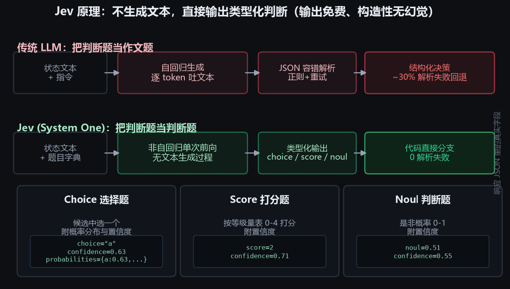

把这个区别想通，它规格单上的每一行都顺理成章了。响应 70 到 500 毫秒，因为不用一个字一个字往外挤；输入 0.042 美元每百万 token、输出免费，因为"生成"这个成本大头在它这里物理上不存在，官方的原话是"便宜到不值得计量"；一次调用可以混装几十道题并行作答、互相隔离、延迟几乎不涨，因为判断本来就是可以并行的脑区。

还有一条容易被当成营销话术、但我实测后选择相信的：它的置信度是校准过的。训练方法叫 RLCD，直译过来是"面向校准决策的强化学习"——模型说自己有九成把握的时候，长期看真有九成是对的。大模型普遍过度自信，明明六七成把握，张嘴就是"我非常确定"，这在自动化流程里很致命，因为你不知道什么时候该信它。校准过的置信度，才能拿来做路由。（当然怎么用才有益也有坑，我在第七节交了一次学费。）

文档翻到最后，官方交代了名字的来历。这个彩蛋我喜欢到现在：Jev 取自十九世纪的经济学家 William Stanley Jevons，就是提出"杰文斯悖论"的那位——蒸汽机效率越高，烧掉的煤反而越多，因为便宜了，大家就往死里用。TypeSafe 给模型起这个名字，赌的是同样的事会在 AI 身上发生：当一次智能判断的成本从几毛钱降到千分之一美分，开发者会把 AI 塞进以前根本不舍得用的地方。

名字就是宣言。他们不打算再造一个更能说的，他们造的是一种便宜到可以挥霍的判断力。

社区也没客气，几天内几百个玩法冒了出来。有人同时开 50 局地铁跑酷让 Jev 实时操控，全程无伤，越跑越快；有人让它跟 Claude Haiku 对打俄罗斯方块，准确率打平，速度快 4 倍，费用是对方的 1/24。

而我盯着那三种题型，心里冒出的是另一件事：这不就是打牌的时候，脑子里那个"快思考"吗？

不过在下注之前，我想先看看别人的牌都是怎么打的。

## 二、热潮里的其他人，都拿这个哑巴干什么

那几天我的时间线已经被 Jev 刷成了大型创意市集。挑几个印象最深的。

玩游戏的是最大一拨。TypeSafe 自己先下了场，官方演示让 Jev 打《毁灭战士》，一次判断 0.114 秒，比很多人类玩家的神经反应还快。有人让它在《任天堂明星大乱斗》里同时操控四个角色混战，愣是打得有来有回——整套方案没有视觉模型，纯靠代码读状态、Jev 做决策，两千多万 token 烧下来也就几美分。更浪漫的是一位叫 Hugo Duprez 的开发者做的忍者跑酷：Jev 一边操控角色躲障碍，一边实时生成下一段关卡，自己给自己出题。

也有人拿它给别的 AI 打工。有开发者给 Claude Code 写了个插件，让 Jev 用几十毫秒扫一遍终端里滚过的几千行日志，判断哪些是垃圾，赶在上下文窗口被撑爆之前清掉——编码智能体的卡顿，很多就卡在这种不起眼的脏活上。Browserbase 的 Kyle Jeong 把浏览器自动化智能体的每一步导航都换成 Jev 判断，理由和打牌一样：这些小判断不值得请大模型，"几分之一美分"才配得上它们的出现频率。

生意场上已经有真金白银的账。有人拿它筛 700 条高意向客户的营销话术，40 秒跑完，9 美分。有人把对冲基金的策略回测从几分钟压到几秒。还有个叫 pg-jev 的 PostgreSQL 插件让我拍案：不会写 SQL 的运营可以直接问"哪些员工可以远程办公"，Jev 从这句人话里判断该查哪些字段、怎么组合——库里 129 条数据，1 秒出结果，花费不到 1 分钱。

生态的火也从侧面证明这波不是自嗨。有人做了个 Jev 案例索引站，从 X、LinkedIn 和 GitHub 收了一千三百多个真实构建，每个案例的价值评分还是 Jev 自己打的——用 Jev 评估 Jev，很有点极客精神。TechCrunch 给它的定性是"来自 ChatGPT 缔造者的一种新模型形态"；Hacker News 上则吵起了另一件事：开源复刻版 Laya 已经出现，"System One 是真范式还是新包装"的争论正酣——这个争论，最后一节我会回来。

热闹里当然也有亏钱的。一位开发者给 Jev 开了全自动股票交易权限，它判断得又快又自信，然后飞快地亏掉了三万多美元。快和自信都不是对的担保，这个反例我记了一路，也直接塑造了后面架构里"护栏"的分量。

看完别人的热闹，回到我自己的题。恰好，我电脑里躺着一个最合适不过的试验场。

## 三、为什么是小丑牌

小丑牌是 2024 年的独立游戏神话。一副扑克打底注，加 150 张效果各异的小丑牌，滚出指数增长的分数曲线：玩家打出对子、顺子、同花这些牌型得分，再用赚到的钱在商店买小丑——有的加固定倍率，有的把分数翻倍，有的围绕特定花色构建一整套体系。一局八个底注轮，分数需求一轮比一轮高，构筑一轮比一轮离谱，最后单手牌滚出几万分。

它的决策结构很妙，恰好被一条线切成两半。

出哪几张牌，是个数学题。手牌最多 8 张，出牌组合满打满算 218 种，穷举就行，一分钱不用花。商店里买哪张小丑，则是个直觉题：协同、成长性、经济、卡组方向，四个维度搅在一起，算不清，只能"感觉"。同一张小丑在不同构筑里价值天差地别；同一个商店，激进和保守的选择能差出两轮寿命。人类玩家管这叫牌感。

一边是能精确计算的，一边是靠直觉判断的——这正好是心理学里的 System 2 和 System 1。而 Jev 的官方定位，就叫 System One 模型。连名字都对上了。

这个领域也已有前辈探路。有人用 GPT-6 级的大模型接上游戏控制接口，真打穿了最高难度金注黑牌组——架构是大模型管战略、数值工具管算分、接口模组管操作，证明了这个游戏 AI 能打穿，也暴露了代价：每步等 5 到 30 秒，一局成本以美元计，而且照样犯低级错误。另一边，强化学习路线的训练成果停在白注两成胜率上下——长视野、部分可观测、稀疏奖励，样本效率上不去；甚至有人拿谷歌的果蝇脑模拟来训，胜率也就 20%。

上限被大模型证明了，代价也被大模型证明了。中间那层"又快又不贵又靠谱"的位置，正好空着。

于是我给自己出了个题：把决策拆开，能算的给代码，靠感觉的给 Jev，都不确定的再留给大模型。然后用真实对局验证，Jev 到底值不值。

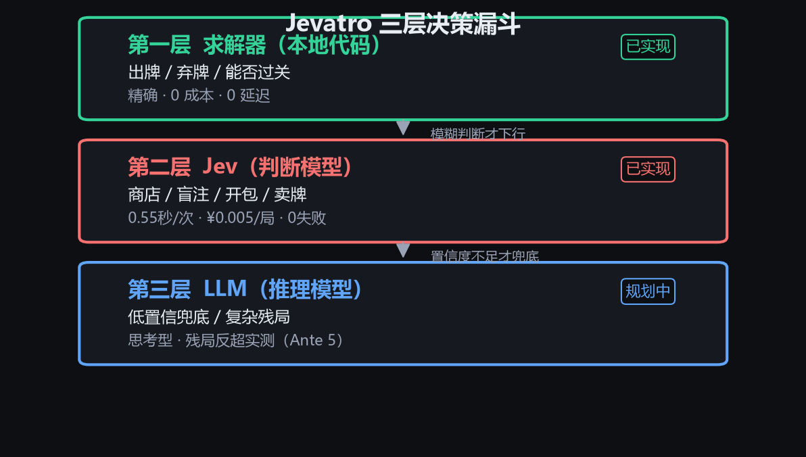

架构长这样，一个三层漏斗。第一层是求解器，本地代码穷举出牌、判断能不能过盲注，精确、零成本、零延迟；第二层是 Jev，接管商店购买、跳盲决策、开包选择这些"直觉题"，亚秒级、近乎免费；第三层是大模型，留给低置信度的关键残局——它什么时候真的有用，第六节有实例。

分层的依据很实在：一个决策点值多少钱，就配多贵的脑子。出牌每轮发生十几次且可精确计算，不值得花一分钱；商店每轮一次且高度模糊，值得花一分钱；残局抉择一局出现不了两次但一步定生死，才值得花几毛钱请思考型大模型。

## 四、把游戏接上：三个坑，一个比一个离谱

控制真实游戏靠的是开源项目 balatrobot——一个跑在游戏里的 Lua 模组，对外提供 JSON-RPC 接口，读局面、出牌、买牌、跳盲、开包，全覆盖。配上 Lovely 注入器和 Steamodded 框架装好之后，本机 12346 端口就是一个"游戏驾驶员座舱"。所有小丑、消耗牌、兑换券的标识符和效果说明都在文档里，我抓下来建了个 266 张卡的释义库，后面喂给 Jev 用。

理想很丰满。实际部署当晚，我踩了三个坑。

第一个坑，文档骗人。接口文档里卡牌的修饰字段写的是对象，实际返回的是数组，算分核心第一次跑就崩了。加了兼容层才通。小事，但它提醒了我：接第三方接口，先拿真实返回值对拍，别信文档。

第二个坑，竞态。发牌动画没放完时调用出牌，游戏内部的按钮对象还是空的，接口直接崩。崩了还不报错——更早的版本里，机器人遇到"小盲 The Psychic（必须出满五张牌）"这种 Boss 约束时，会把四张牌的组合发出去，游戏表面接受、实际零分，白白烧掉一手。我干脆把 17 类 Boss 盲的规则做成了一个前置规则引擎：必须出五张的只枚举五张组合，花色削弱 Boss 让对应牌零计分，禁止重复牌型的 Boss 在枚举层就过滤。非法出牌从此为零。

第三个坑最离谱：游戏会装死。有天早上跑批量测试，每一局都在第一轮冻结。进程活着，接口能应，画面截图正常，就是不出分。我查了两个小时，从超时日志一路查到渲染机制，根因让人哭笑不得：这个游戏引擎的渲染和逻辑跑在同一个循环里，游戏窗口一旦被别的窗口完全挡住，垂直同步会把渲染卡住，整个游戏跟着一起停摆。解法是把游戏窗口缩小置顶到屏幕角落，让它永远露出一块。从此批量测试全速。

顺手的好事也有一件：修这个坑的时候，我给模组打了 4 倍速补丁，机器人打牌动画拉满，三配置对比 24 局 70 分钟跑完。

## 五、教 Jev 看牌

Jev 不认识小丑牌，j_gros_michel 对它来说就是一串字符。所以第一步是把游戏局面序列化成一段紧凑的中文描述：

```
[局] 第3轮/8周目, 第4局, 金币$28, 手数4, 弃牌3, 已得chips 1170
[盲注] ▶Boss Blind 需2400
[常用牌型] 两对Lv3(60×7,已打12次), 同花Lv2(45×6,已打5次)
[小丑] 1. j_fortune_teller(占卜师): 每使用一张塔罗牌+1倍率, 现x2.3
[手牌] ♠A ♥3 ♦3 ♣3 ♠7 ♥9 ♦J ♣2
[商店] 小丑: j_hologram(全息影像): 每添加一张牌永久+x0.25倍率 $7
[求解器事实] 最优出牌: 三条 = 312分; 四手满打预计 1100/2400 (不足)
```

这里有两个刻意的设计。每张小丑都带一句人话释义，让 Jev 靠语义而不是靠记忆 ID 去理解；末尾附上求解器算出的"硬事实"。这样 Jev 只需要判断分数之外的东西——协同好不好、方向对不对。它不用重新算数，也算不了数。

然后是提问。以商店决策为例，每个候选商品问四道打分题：协同性（和现有构筑的配合，0 冲突到 4 核心拼图）、成长性（长期复利潜力）、经济性（对金钱利息循环的贡献）、即时战力（对接下来一两个盲注的得分帮助）。再加一道方向单选题——"当前构筑最接近哪个流派：对子/同花/顺子/高牌/未定"——按方向混不同的权重表，对子流更看重协同，未定型更看重成长。缺槽位想换将时，加一道选择题问"卖谁损失最小"；考虑跳盲时，一道判断题"跳过它换奖励标签是否更合理"。

这些题全部装进一次调用。20 多道题并行作答，延迟还是亚秒级——这是 Jev 最让我惊艳的地方。换成传统大模型，一题一答，每答一次等几秒，20 道题串下来，一个商店能逛出泡面的时间。

落到代码是三段式：构造题目、一次调用、数学接管。

```python
# ① 题目构造：每个候选 × 四道打分题 + 一道方向单选 + 一道跳盲判断
questions = {f"item{i}_{dim}": Score(instructions=DIMS[dim], criteria=RUBRIC[dim])
             for i, cand in enumerate(candidates) for dim in DIMS}
questions["arch"] = Choice(instructions="当前构筑最接近的方向", criteria=ARCH_CHOICE)
questions["skip"] = Noul(instructions="跳过本盲注换奖励标签是否更合理")

# ② 一次批量调用（上面所有题并行、互相隔离）
resp = jev.ask(state_text, questions)

# ③ 代码做数学：按方向取权重表，加权求和，超阈值才买
value = sum(resp.answers[f"item{i}_{dim}"].score * W[arch][dim] for dim in DIMS)
buy   = value >= TAU and money >= price
```

注意第三步：买不买由代码里确定的数学决定，不是模型拍脑袋。权重表、阈值、护栏全在版本控制里，改参数不用改提示词，同种子回归几分钟一轮。这是判断模型带来的一个隐藏工程红利——决策逻辑可审计，出问题能定位到是哪个权重、哪道题的锅。

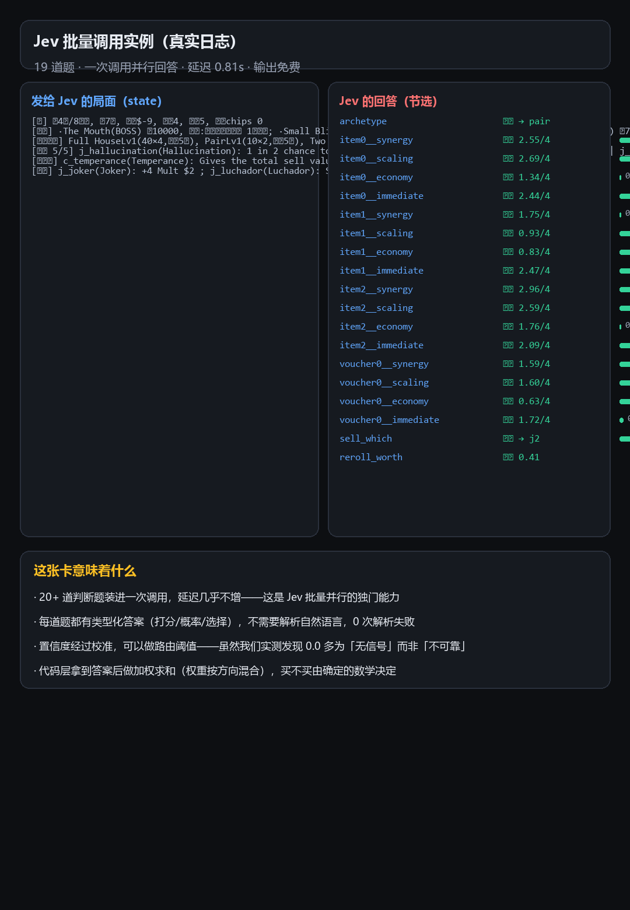

上面这张卡是一次真实调用的记录，左边是发给 Jev 的局面原文，右边是它的 19 个回答，打分、概率、选择，每题自带置信度。回退机制也备好了：Jev 接口一旦抽风，自动降级到朴素策略（买得起的第一张小丑），对局永不中断。

## 六、实测：Jev 对阵传统大模型

光讲架构是自嗨，上数据。我做了三套配置：纯求解器基线、求解器加 Jev、求解器加大模型（先接智谱的 glm-4-flash 免费档，后换 DeepSeek 的 deepseek-flash 思考型）。同样的 8 个种子各打一局，24 局成对对比——同种子意味着同样的起手牌、同样的商店序列、同样的 Boss 顺序，差异只剩决策大脑本身。

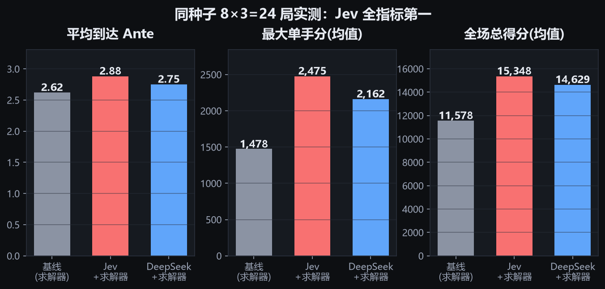

24 局跑完，Jev 全指标第一：平均到达 2.88 个底注轮（基线 2.62，DeepSeek 2.75；这个差距在 9 种子复核后落在单局方差内，文末口径说明里有交代），最大单手分均值 2475，基线只有 1478，高出 68%；全场总得分高出基线 32%。购买数也最有进攻性，平均一局买 7 件，基线只买 4 件——敢买且买得对，这就是"牌感"的量化形态。

代价那边的差距就不好看了。

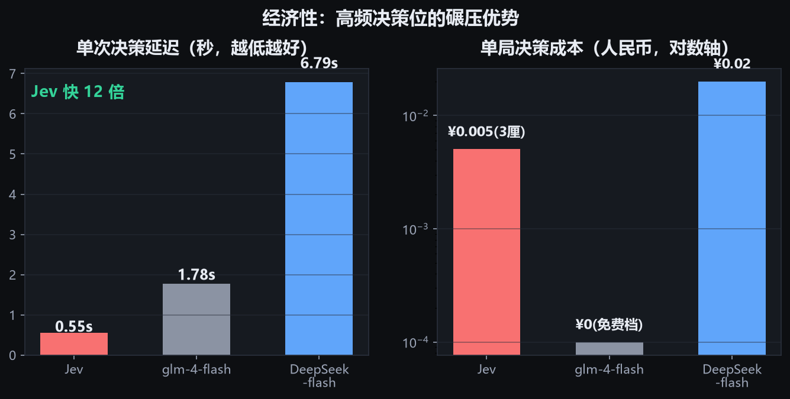

Jev 单次决策 0.55 秒，DeepSeek 思考型 6.79 秒，12 倍。成本上我后来专门补了一轮"全记账局"，给两层决策都加上逐次 token 落盘，按官方价目核账。实测 Jev 一局消耗 45,415 输入加 5,029 输出 token，0.0019 美元，约人民币一分四；DeepSeek 一局 11,129 输入加 35,367 输出 token，0.046 美元，约三毛三。单局成本 Jev 是它的 1/18 到 1/24。

这轮核账还纠正了我自己的一个误判。早期只按输入 token 估算时，我以为 DeepSeek 一局也就两分钱，实测翻了近八倍——大头全在思考过程的输出 token 上，9 局合计 15 万个。相当于每想一件事，草稿纸就烧掉一沓。计费口径不看输出侧，就会漏掉思考型模型真正的成本结构。

更隐蔽的是稳定性。100 次 DeepSeek 调用里约 30 次因为超时或 JSON 格式问题失败回退，决策质量悄悄塌回启发式；而 Jev 的 149 次调用零失败——类型化输出不需要解析，自然也就没有解析失败。

行为风格的差异也有意思。跳盲决策上 DeepSeek 明显激进，场均跳 1.75 次；Jev 的概率判断天然保守，0.38 次。方差上 DeepSeek 更飘——上限局能打到全场最深的 Ante 5，下限局第一轮就暴毙；Jev 的成绩集中在 Ante 2 到 4，是个稳定的优等生。

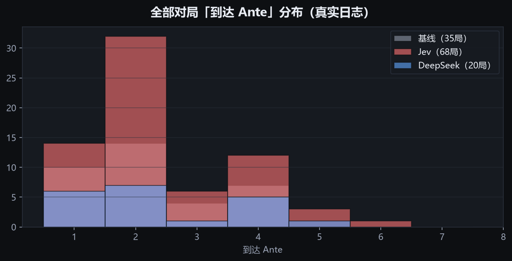

全部 130 多局的真实分布讲的是同一个故事：Jev 的曲线整体右移且更稳，DeepSeek 的曲线更宽。

这里必须诚实记录一个反例。有一个种子，Jev 判断失误止步 Ante 2，DeepSeek 靠长推理硬是打到 Ante 4；还有一局，DeepSeek 打出了全部 24 局里最深的 Ante 5。思考型大模型在复杂残局的推理深度是真实优势——这正是三层架构里给它留位置的依据。只是这种时刻一局出现不了几次，让它守低频关键点，比让它每一步都上，划算得多。

## 七、翻车合集：比成功更值钱的部分

这个项目最有趣的产出，可能不是战绩，是四条用真金白银——好吧，真 token——换来的教训。

第一条：别给 AI 太激进的选择权。最初让大模型自己决定跳不跳盲注，DeepSeek 上来连跳两个小盲，白拿奖励标签，然后拖着空空如也的小丑槽直冲 Boss 盲，当场暴毙。修复方式很朴素：代码层加护栏，每个底注轮最多跳一次盲。模型负责判断，护栏负责底线，这个分工到现在没再出过事。

第二条：置信度为零不等于不可靠。我最初按官方文档的建议，把 Jev 的置信度当硬门槛，低于 0.4 就拒绝购买。结果 Jev 层一整局什么都没买，活活穷死在第二关。翻日志发现，大量维度的置信度是 0.0，但打分本身明明合理。后来想明白了：Jev 的 0.0 置信度多数时候是"无信号"，不是"不可靠"。校准值适合做路由参考，不能当否决票。改成只记录不门控之后，购买立刻活跃起来，成绩跟着回升。

第三条：囤钱至死的真相。我写了个死因分析脚本，把 95 局的"验尸报告"拉出来，发现一个反直觉的事实：深局死亡时平均还剩 46 金币、小丑槽满员——不是没钱，是钱没花对。死因是单轮爆发不足，最惨的一局打出 9542 分，需求 10000，差 5%，攥着 58 块钱去世。

第四条：解药开错比病更糟。针对囤钱问题，我第一版改成"金币超过利息上限就放宽购买阈值"，16 个种子跑下来傻眼了：死时金币从 46 掉到 6，钱是花出去了，但全买了平庸货，平均成绩从 2.88 掉到 2.06，净负优化。方向对的洞察配上错的解法，等于白折腾。第二版撤回泛买，改成在局面里加"经济警示"和"战力警示"两条信息让 Jev 自己权衡——复测均值回到 2.62，并且打出了全项目最深的 Ante 6，离通关只差两轮。

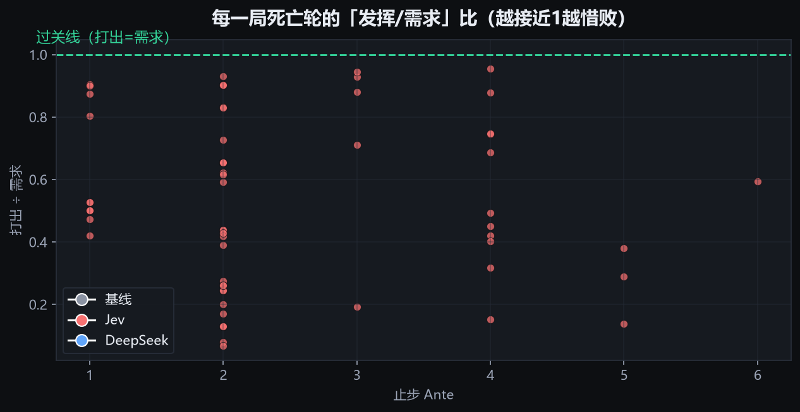

这张散点图每一颗点是一局死亡时"发挥÷需求"的比例。贴着上方绿线的都是惜败局，差一口气。而惜败局最多的配置恰恰是 Jev——它把局打得更接近赢。把失败从大溃败变成惜败，本身就是判断力的证明。

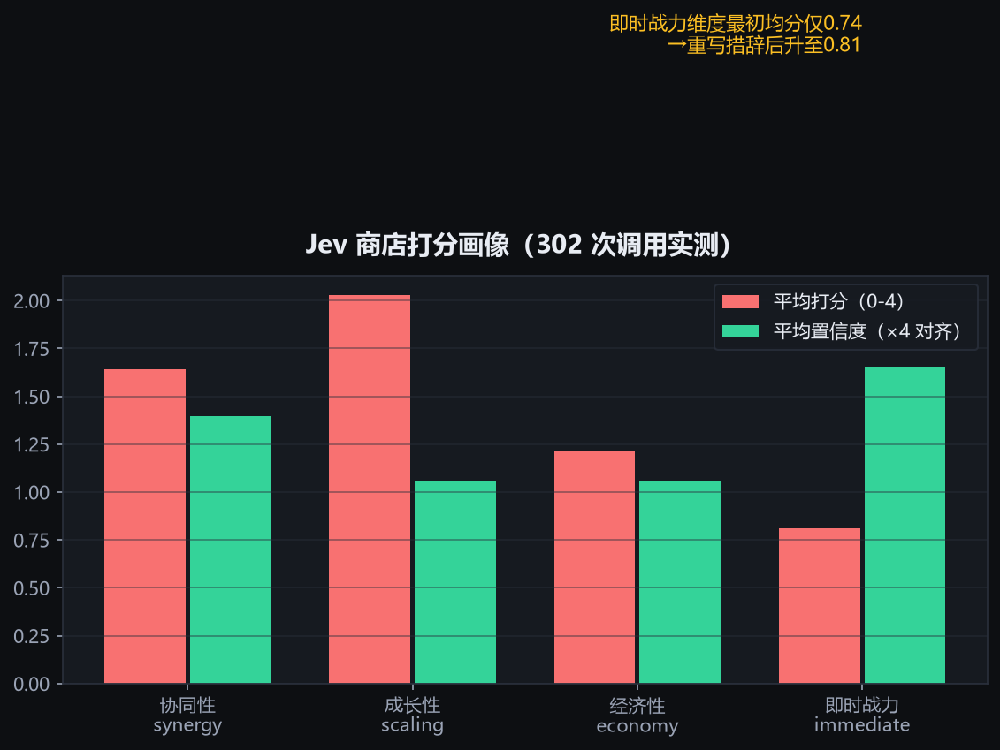

Jev 自己的"牌感画像"也能量化。302 次调用统计下来，成长性维度打分最高，2.03 分（满分 4，它很看重复利）；即时战力维度最初只有 0.74——排查发现是措辞太苛刻，"能否立刻过关"这种表述几乎不可能给高分，改写成"对接下来一两个盲注的帮助"后升到 0.81。提示词工程对判断模型同样成立，而且迭代成本几乎为零：改一版措辞，几分钟就能在同种子上回归验证。这个迭代闭环比大模型时代快一个数量级。

## 八、给它装了一块仪表盘

调试到后期，命令行日志已经不够看了。参考 Jev 官方那个著名的俄罗斯方块演示页，我做了一个深色观测台。

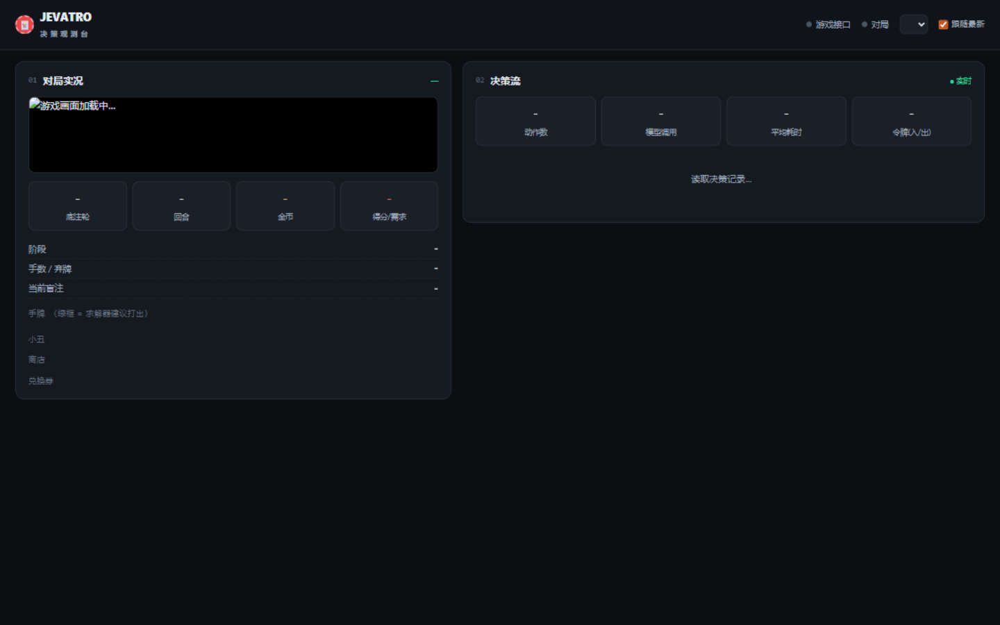

左栏是实时游戏画面加局面数据：手牌可视化、每张牌的修饰标记、商店商品，还有求解器的出牌建议——绿框直接标在它要打的牌上。右栏是实时决策流：每一次 Jev 调用、每一次购买、每一次出牌，按时间正序自动滚动，点开任何一张卡片都能看到完整的请求原文和回答原文，连置信度条都画好了。跑批的时候挂着它，等于坐在机器人旁边看它打牌，顺便偷听它的脑内弹幕。

截图不够过瘾，我录了一段同框实况：左边是游戏本体在 4 倍速下打牌，右边是观测台同步刷新——出牌、购买、Jev 调用按时间滚进决策流，顶栏统计条里的调用次数、平均耗时和 token 消耗实时跳动。注意看中段进商店的那几秒：Jev 的打分卡片刚弹出来，买牌动作紧随其后，"它一边打一边想"这件事肉眼可见。


（发布注：此处为本地视频 13_观测台实况_剪辑版.mp4，33 秒、9.3MB，用开源剪辑器 OpenCut 加了标题字幕后导出的成品；原始素材 13_观测台实况.mp4 同目录备查。公众号编辑器里以"视频→本地上传"插入。）

再来一段纯游戏视角的浓缩 GIF，注意看它买牌的节奏和跳盲的抉择，全是 Jev 在幕后判断：

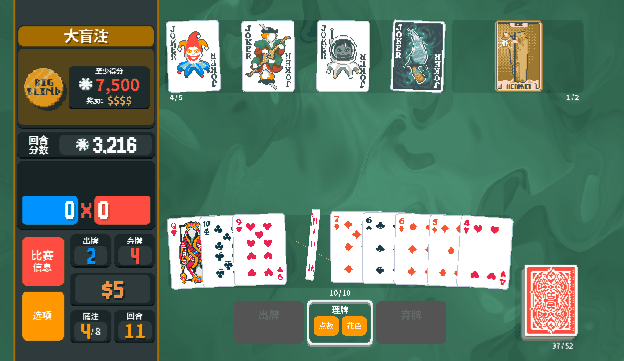

## 九、所以，Jev 到底该怎么用

130 多局实测、10 轮迭代下来，我的答案可以收敛成三句话。

第一，高频判断位是它的主场。商店每轮都要逛、盲注每个都要选、开包每次都要挑，这些决策单次价值不高但频次极高，要的是快、便宜、稳定、可校准。Jev 四样全占：0.55 秒，一分钱一局，零失败，置信度原生校准。传统大模型在这些位置上不是不行，是杀鸡用牛刀，而且牛刀还钝——12 倍延迟、三成回退、18 倍成本。反过来，一局游戏里真正需要"深度思考"的决策可能就一两个，把思考型大模型铺满每一个决策点，96% 的算力是浪费。

第二，它不取代推理，它过滤推理。三层漏斗的真正价值是把昂贵的思考留给稀有的难题。实测里 DeepSeek 在残局反超 Jev 的那两局，就是漏斗底层该接住的时刻。这个结构放到业务里同样成立：内容审核的逐条分级交给判断模型，只有边缘案例才升级到大模型；客服工单的路由逐单交给判断模型，只有高价值客诉才请推理模型出场。判断模型是新的性价比层，不是大模型的替代品。

第三，判断模型的效果一半在题目。打分维度的措辞、阈值的位置、权重的配比、方向题的选项设计，这些"题目工程"对结果的影响不亚于换模型。我们实测里一次措辞修改让一个维度的均分从 0.74 升到 0.81；一次错误的阈值放宽让平均成绩掉 0.8 个 Ante。好消息是 Jev 的迭代闭环极短——改措辞、跑同种子、看数据，几分钟一轮。这个工作流本身，可能比 Jev 更值得复制。

至于战绩，白注稳定 Ante 4 到 6，还没打穿 Ante 8 通关。差距集中在两处：惜败局的那一口气（单轮再多 25% 爆发），以及 X 倍率引擎的成型率。下一步方向已经明确：把囤下的钱引向确定性的升级，比如星球卡升主牌型，而不是更贵的直觉。通关之后游戏还有无限模式，那才是构筑引擎的终极考场。

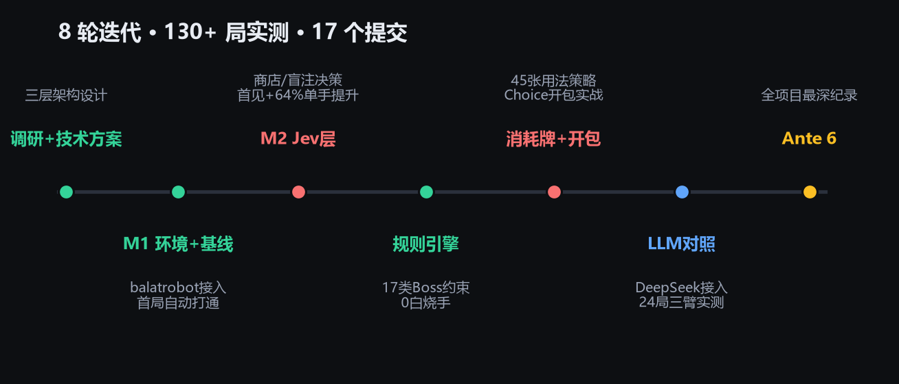

最后说回 Jevons 的那个赌。写这篇复盘的时候我算了下账：因为一局一分钱，我让 Jev 出现在了每一次商店、每一个盲注、每一回开包，130 多局累计花了不到一毛钱——要是每次判断都按大模型的价钱，我根本不敢这么铺。蒸汽机效率越高烧煤越多，这个一百五十年前的悖论，在一个打牌的小项目里先应验了一半。等工具链成熟，判断成本再降一个量级，该有多少以前"不值得用 AI"的地方被填上，我不敢想。

说白了，Jev 不是来抢大模型饭碗的。大模型负责干活，Jev 负责在旁边花几十毫秒看一眼，判断这活干得行不行。过去几年，我们一直在追求让模型写得更好、说得更像人；Jev 反其道行之——有些事，也许根本不需要说得多漂亮，直接把结论给出来，反而更有效。

当然，冷水也要泼。Jev 还在 early access，社区一直有人质疑：它到底是真创新，还是一个换了包装的分类器？官方没发论文，参数和训练细节都没披露，RLCD 是全新范式还是旧方法的新名字，暂时没法下定论；开源复刻版 Laya 的出现，让"同一思路、一个闭源一个开源"的争论还在发酵。我这 130 多局能证明的也有限——白注、红牌组、没通关、样本量放在统计学家面前不够看。但方向本身值得每个做 AI 应用的人亲手试一试：把你的业务拆开，找出那些高频、模糊、不值几毛钱的判断题，算算它们本来该花多少钱。

小丑牌的下一局，交给 Jev；你的下一个高频决策场景，或许也是。

---

*项目数据口径说明：文中对比数据来自同种子成对实测（8 种子×3 配置=24 局 + 历史批次共 130+ 局），延迟与 token 消耗为真实调用统计，成本按两家官方价目核账（Jev 输入 $0.042/M 输出免费；deepseek-flash 输入 $0.30/M 输出 $1.20/M，2026-09-22 查证，逐次调用台账见项目 cost_report.md）。诚实标注：补充第 9 个种子后，三臂平均到达 Ante 的差异落在单局方差（±1 Ante）之内，Jev 的稳定优势体现在单手分上限、总得分、延迟、成本与零失败，而非 Ante 均值。公开报道的 GPT-6 金注通关战绩来自媒体，未在本项目复现。第二节社区案例（地铁跑酷、俄罗斯方块对打、《毁灭战士》与《大乱斗》演示、忍者跑酷、Claude Code 日志清理插件、浏览器智能体、营销话术筛选、对冲基金回测、pg-jev、交易机器人亏损、1300+ 案例索引、开源复刻 Laya 等）整理自公开发表的社区分享与媒体报道（含 Jack Cui 的案例汇编、The Register、TechCrunch、LangChain 指南），均未在本项目复现。*

*小丑牌（Balatro）© LocalThunk，请支持正版。本文仅供技术研究交流。*
